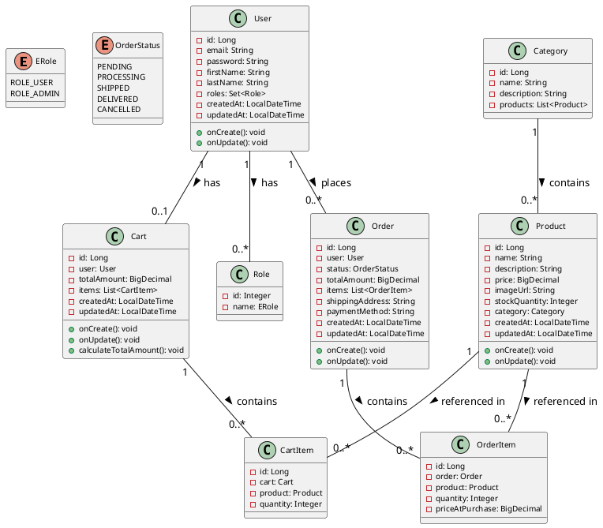

# Shop Lite Class Diagram Documentation

## Overview

This document provides a detailed explanation of the class diagram for the Shop Lite e-commerce application. The class diagram represents the database structure and relationships between entities in the system.

## Class Diagram

## Detailed Entity Descriptions

### User Entity

The `User` entity represents individuals who use the Shop Lite platform.

**Attributes:**
- `id`: Unique identifier (Primary Key)
- `email`: User's email address (unique, required)
- `password`: Encrypted password
- `firstName`: User's first name
- `lastName`: User's last name
- `roles`: Collection of roles assigned to the user
- `createdAt`: Timestamp when the user account was created
- `updatedAt`: Timestamp when the user account was last updated

**Methods:**
- `onCreate()`: Automatically sets creation timestamp
- `onUpdate()`: Updates the last modified timestamp

**Relationships:**
- One-to-many with `Role`: A user can have multiple roles
- One-to-one with `Cart`: Each user has at most one active shopping cart
- One-to-many with `Order`: A user can place multiple orders

### Role Entity

The `Role` entity defines permissions within the application.

**Attributes:**
- `id`: Unique identifier (Primary Key)
- `name`: Role name (ROLE_USER, ROLE_ADMIN)

**Relationships:**
- Many-to-many with `User`: Multiple users can have the same role

### Product Entity

The `Product` entity represents items available for purchase.

**Attributes:**
- `id`: Unique identifier (Primary Key)
- `name`: Product name (required)
- `description`: Detailed description of the product
- `price`: Product price
- `imageUrl`: URL to product image
- `stockQuantity`: Available quantity in inventory
- `category`: Product category
- `createdAt`: When the product was added
- `updatedAt`: When the product was last modified

**Methods:**
- `onCreate()`: Sets creation timestamp
- `onUpdate()`: Updates modification timestamp

**Relationships:**
- Many-to-one with `Category`: Products belong to a category
- One-to-many with `CartItem`: Products can be in multiple shopping carts
- One-to-many with `OrderItem`: Products can be in multiple orders

### Category Entity

The `Category` entity organizes products into logical groups.

**Attributes:**
- `id`: Unique identifier (Primary Key)
- `name`: Category name (unique, required)
- `description`: Category description
- `products`: Collection of products in this category

**Relationships:**
- One-to-many with `Product`: A category contains multiple products

### Cart Entity

The `Cart` entity represents a user's shopping cart.

**Attributes:**
- `id`: Unique identifier (Primary Key)
- `user`: Cart owner
- `totalAmount`: Total value of items in cart
- `items`: Collection of items in the cart
- `createdAt`: When the cart was created
- `updatedAt`: When the cart was last modified

**Methods:**
- `onCreate()`: Sets creation timestamp
- `onUpdate()`: Updates modification timestamp
- `calculateTotalAmount()`: Computes the cart total based on items

**Relationships:**
- One-to-one with `User`: Each cart belongs to exactly one user
- One-to-many with `CartItem`: A cart contains multiple items

### CartItem Entity

The `CartItem` entity represents a product added to a cart with a specified quantity.

**Attributes:**
- `id`: Unique identifier (Primary Key)
- `cart`: The cart containing this item
- `product`: The product added to cart
- `quantity`: Number of product units

**Relationships:**
- Many-to-one with `Cart`: Multiple items can be in the same cart
- Many-to-one with `Product`: Multiple cart items can reference the same product

### Order Entity

The `Order` entity represents a completed purchase.

**Attributes:**
- `id`: Unique identifier (Primary Key)
- `user`: User who placed the order
- `status`: Current order status (PENDING, PROCESSING, etc.)
- `totalAmount`: Total order value
- `items`: Collection of items in the order
- `shippingAddress`: Delivery address
- `paymentMethod`: Payment method used
- `createdAt`: When the order was placed
- `updatedAt`: When the order was last modified

**Methods:**
- `onCreate()`: Sets creation timestamp
- `onUpdate()`: Updates modification timestamp

**Relationships:**
- Many-to-one with `User`: Multiple orders can be placed by the same user
- One-to-many with `OrderItem`: An order contains multiple items

### OrderItem Entity

The `OrderItem` entity represents a product included in an order.

**Attributes:**
- `id`: Unique identifier (Primary Key)
- `order`: The order containing this item
- `product`: The ordered product
- `quantity`: Quantity of the product ordered
- `priceAtPurchase`: Historical price at time of purchase

**Relationships:**
- Many-to-one with `Order`: Multiple items can be part of the same order
- Many-to-one with `Product`: Multiple order items can reference the same product

## Enumerated Types

### ERole Enumeration
- `ROLE_USER`: Standard user privileges
- `ROLE_ADMIN`: Administrative privileges

### OrderStatus Enumeration
- `PENDING`: Order placed but processing has not started
- `PROCESSING`: Order is being prepared
- `SHIPPED`: Order has been dispatched
- `DELIVERED`: Order has been delivered
- `CANCELLED`: Order has been cancelled

## Relationship Types

1. **One-to-One Relationships**
   - User to Cart: Each user has at most one active shopping cart

2. **One-to-Many Relationships**
   - Category to Products: A category contains multiple products
   - Cart to CartItems: A cart contains multiple cart items
   - Order to OrderItems: An order contains multiple order items
   - User to Orders: A user places multiple orders

3. **Many-to-One Relationships**
   - Products to Category: Multiple products belong to a category
   - CartItems to Cart: Multiple cart items belong to a cart
   - CartItems to Product: Multiple cart items can reference the same product
   - OrderItems to Order: Multiple order items belong to an order
   - OrderItems to Product: Multiple order items can reference the same product

4. **Many-to-Many Relationships**
   - User to Roles: Users can have multiple roles, and roles can be assigned to multiple users (implemented using a join table)