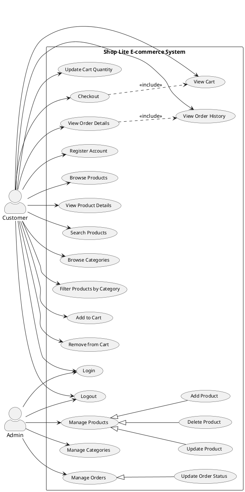

# Shop Lite Use Case Diagram Documentation

## Overview

This document provides a detailed explanation of the use case diagram for the Shop Lite e-commerce application. The use case diagram illustrates the interactions between users and the system, capturing all the key functionality available in the application.

## Use Case Diagram

## Actors

### Customer
The Customer actor represents a regular user of the Shop Lite e-commerce application. Customers can browse products, add items to their cart, place orders, and manage their account information. They interact with the system primarily for shopping purposes.

### Admin
The Admin actor represents users with administrative privileges. Admins can manage products, categories, and orders across the entire system. They are responsible for maintaining the catalog, monitoring order fulfillment, and ensuring the smooth operation of the e-commerce platform.

## Use Case Descriptions

### Authentication Use Cases

#### Register Account
- **Actor**: Customer
- **Description**: Allows a new user to create an account in the system
- **Preconditions**: User is not logged in
- **Main Flow**:
  1. User provides email, password, and personal information
  2. System validates inputs
  3. System creates a new user account
  4. System sends a confirmation email
  5. User is directed to login
- **Alternative Flows**:
  - Email already exists: System shows error message
  - Invalid input: System shows validation errors
- **Postconditions**: User account is created

#### Login
- **Actor**: Customer, Admin
- **Description**: Authenticates a user and provides access to the system
- **Preconditions**: User has a registered account
- **Main Flow**:
  1. User enters email and password
  2. System validates credentials
  3. System generates authentication token
  4. User gains access to authenticated features
- **Alternative Flows**:
  - Invalid credentials: System shows error message
  - Account locked: System shows account status message
- **Postconditions**: User is authenticated and session is established

#### Logout
- **Actor**: Customer, Admin
- **Description**: Ends the user's current session
- **Preconditions**: User is logged in
- **Main Flow**:
  1. User requests to logout
  2. System invalidates authentication token
  3. User is redirected to public area
- **Postconditions**: User session is terminated

### Product Management Use Cases

#### Browse Products
- **Actor**: Customer
- **Description**: Allows customers to view available products
- **Preconditions**: None
- **Main Flow**:
  1. User accesses the product catalog
  2. System displays paginated list of products with basic information
  3. User can navigate through pages
- **Postconditions**: User views available products

#### View Product Details
- **Actor**: Customer
- **Description**: Shows comprehensive information about a specific product
- **Preconditions**: Product exists in the system
- **Main Flow**:
  1. User selects a product from the catalog
  2. System retrieves detailed product information
  3. System displays comprehensive product details
- **Postconditions**: User views detailed product information

#### Search Products
- **Actor**: Customer
- **Description**: Allows finding products based on keywords
- **Preconditions**: None
- **Main Flow**:
  1. User enters search keywords
  2. System queries the product database
  3. System displays matching products
- **Alternative Flows**:
  - No results found: System shows "no results" message
- **Postconditions**: User views search results

#### Browse Categories
- **Actor**: Customer
- **Description**: Displays product categories for navigation
- **Preconditions**: None
- **Main Flow**:
  1. User accesses category listing
  2. System displays available categories
  3. User can select a category
- **Postconditions**: User views available categories

#### Filter Products by Category
- **Actor**: Customer
- **Description**: Shows products belonging to a specific category
- **Preconditions**: Category exists in system
- **Main Flow**:
  1. User selects a category
  2. System queries products in that category
  3. System displays filtered product list
- **Postconditions**: User views category-specific products

### Shopping Cart Use Cases

#### Add to Cart
- **Actor**: Customer
- **Description**: Adds a product to the user's shopping cart
- **Preconditions**: User is logged in, Product is in stock
- **Main Flow**:
  1. User selects a product
  2. User specifies quantity
  3. User adds product to cart
  4. System updates cart with product
- **Alternative Flows**:
  - Insufficient stock: System shows availability message
- **Postconditions**: Product is added to user's cart

#### Remove from Cart
- **Actor**: Customer
- **Description**: Removes an item from the shopping cart
- **Preconditions**: User has items in cart
- **Main Flow**:
  1. User views cart
  2. User selects item to remove
  3. System removes item from cart
  4. System updates cart totals
- **Postconditions**: Item is removed from cart

#### View Cart
- **Actor**: Customer
- **Description**: Shows the current contents of the shopping cart
- **Preconditions**: User is logged in
- **Main Flow**:
  1. User accesses cart view
  2. System retrieves cart contents
  3. System displays items, quantities, and totals
- **Postconditions**: User views current cart contents

#### Update Cart Quantity
- **Actor**: Customer
- **Description**: Changes the quantity of a product in the cart
- **Preconditions**: User has items in cart
- **Main Flow**:
  1. User views cart
  2. User modifies quantity for an item
  3. System validates against stock availability
  4. System updates cart with new quantity
  5. System recalculates totals
- **Alternative Flows**:
  - Insufficient stock: System shows availability message
- **Postconditions**: Cart is updated with new quantities

### Order Management Use Cases

#### Checkout
- **Actor**: Customer
- **Description**: Converts cart contents to an order
- **Preconditions**: User is logged in, Cart has items
- **Main Flow**:
  1. User initiates checkout
  2. System validates cart contents
  3. User provides shipping address
  4. User selects payment method
  5. User confirms order
  6. System creates order record
  7. System clears the cart
- **Alternative Flows**:
  - Payment failure: System shows payment error
  - Stock changed: System notifies about availability changes
- **Postconditions**: Order is created and cart is emptied

#### View Order History
- **Actor**: Customer
- **Description**: Shows a list of past orders
- **Preconditions**: User is logged in
- **Main Flow**:
  1. User accesses order history
  2. System retrieves user's orders
  3. System displays order list with basic information
- **Postconditions**: User views order history

#### View Order Details
- **Actor**: Customer
- **Description**: Shows detailed information about a specific order
- **Preconditions**: User is logged in, Order exists
- **Main Flow**:
  1. User selects an order from history
  2. System retrieves detailed order information
  3. System displays order details including items, status, and shipping info
- **Postconditions**: User views detailed order information

### Administrative Use Cases

#### Manage Products
- **Actor**: Admin
- **Description**: Umbrella use case for product administration
- **Preconditions**: User has admin privileges
- **Sub-use cases**: Add Product, Update Product, Delete Product

#### Add Product
- **Actor**: Admin
- **Description**: Creates a new product in the system
- **Preconditions**: User has admin privileges
- **Main Flow**:
  1. Admin accesses product management
  2. Admin provides product details and images
  3. System validates input
  4. System creates new product record
- **Postconditions**: New product is available in catalog

#### Update Product
- **Actor**: Admin
- **Description**: Modifies an existing product
- **Preconditions**: User has admin privileges, Product exists
- **Main Flow**:
  1. Admin selects product to edit
  2. Admin modifies product details
  3. System validates input
  4. System updates product record
- **Postconditions**: Product information is updated

#### Delete Product
- **Actor**: Admin
- **Description**: Removes a product from the system
- **Preconditions**: User has admin privileges, Product exists
- **Main Flow**:
  1. Admin selects product to delete
  2. Admin confirms deletion
  3. System removes or deactivates product
- **Postconditions**: Product is no longer available in catalog

#### Manage Categories
- **Actor**: Admin
- **Description**: Creates, updates, or deletes product categories
- **Preconditions**: User has admin privileges
- **Main Flow**:
  1. Admin accesses category management
  2. Admin can add, edit, or remove categories
  3. System updates category structure
- **Postconditions**: Category structure is updated

#### Manage Orders
- **Actor**: Admin
- **Description**: Umbrella use case for order administration
- **Preconditions**: User has admin privileges
- **Sub-use cases**: Update Order Status
- **Main Flow**:
  1. Admin accesses order management
  2. Admin can view all orders in the system
  3. Admin can filter and search orders
- **Postconditions**: Admin views order information

#### Update Order Status
- **Actor**: Admin
- **Description**: Changes the status of an order
- **Preconditions**: User has admin privileges, Order exists
- **Main Flow**:
  1. Admin selects an order
  2. Admin changes order status
  3. System updates order record
  4. System may send notifications to customer
- **Postconditions**: Order status is updated

## Relationship Types

### Association Relationships
Connecting actors to the use cases they can perform:
- Customer can perform customer-oriented actions like browsing products, managing cart, and placing orders
- Admin can perform administrative actions like managing products, categories, and orders

### Generalization Relationships
Connecting general use cases to more specific sub-use cases:
- ManageProducts generalizes AddProduct, UpdateProduct, and DeleteProduct
- ManageOrders generalizes UpdateOrderStatus

### Include Relationships
Connecting use cases that include other use cases as part of their flow:
- Checkout includes ViewCart (users must view their cart during checkout)
- ViewOrderDetails includes ViewOrderHistory (users typically navigate from order history to details)